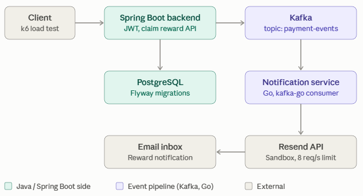
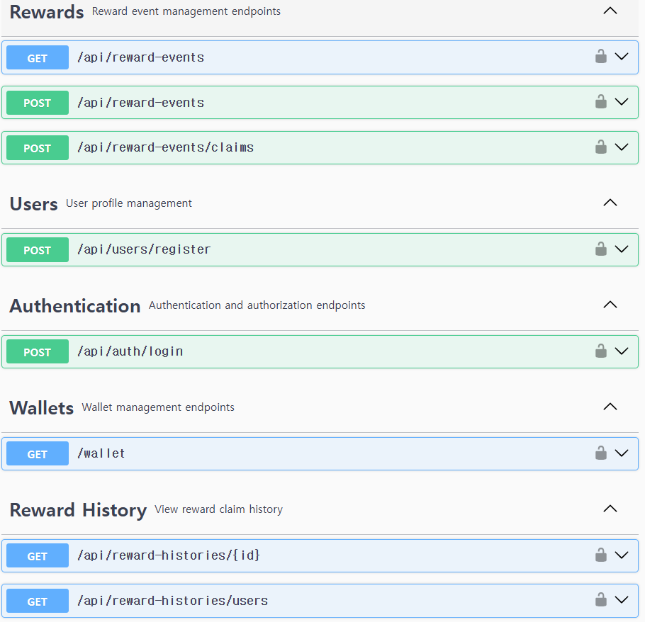

# 결제·리워드 백엔드 시스템

동시 요청 환경에서 데이터 정합성, 성능, 비동기 이벤트 처리​를 검증하기 위해 구현한 결제·리워드 백엔드 프로젝트입니다.
동시성 문제를 k6로 검증하고, 결제 처리와 알림 처리를 Kafka 기반 비동기 구조로 분리했습니다.

배포 서버 : http://kyungmunkang.com/swagger-ui/index.html

## 목차

* [프로젝트 개요](#프로젝트-개요)
* [기술 스택](#기술-스택)
* [아키텍처](#아키텍처)
* [주요 기능](#주요-기능)
* [트러블 슈팅](#트러블-슈팅)
* [회고](#회고)

## 프로젝트 개요

동시에 많은 요청이 발생하는 상황에서 다음 문제를 검증하고 해결하는 것을 목표로 했습니다.

동시 요청 시 수량과 잔액의 정합성이 유지되는가?\
동시 요청 시 API 응답 성능을 유지할 수 있는가?\
알림 처리로 인해 핵심 결제/리워드 처리 속도가 저하되지 않는가?\
외부 API의 요청 제한 상황을 안정적으로 처리할 수 있는가?\
기능이 추가되고 코드가 변경되어도 기존 기능을 자동으로 검증할 수 있는가?

- 기간: 2026-07 ~ 2026-09
- 형태: 개인 프로젝트

## 기술 스택

Backend : 

Messaging / Infra : 

Testing / CI : 

## 아키텍처

## 주요 기능

**백엔드 컨테이너**

유저 : 회원가입, 로그인

리워드 : 리워드 이벤트 생성, 리워드 요청, 리워드 내역 조회

지갑 : 현재 금액 조회

**알림 컨테이너**

Resend를 이용한 메일 발송

## 트러블 슈팅

문제 1: Reward 요청에 Optimistic Lock을 이용했으나, 재고가 남았는데 지급이 실패하는 문제.

해결 : 해당 로직을 k6부하 테스트를 이용해 Pessimistic Lock과 Atomic Update의 속도를 비교 후 Atomic Update의 빠른 속도로 인해 채용

Optimistic Lock

테스트 조건
- 총 유저수: 50
- 리워드 수량: 20

결과
- 성공 수: 5
- 충돌 수: 45
- 비정상 오류: 0

HTTP 지표
- 총 요청: 151
- 실패 요청 비율: 62.91%
- 평균 속도: 37.99ms
- p95 속도: 71.07ms

Pessimistic Update

테스트 조건
- 총 유저수: 500
- 리워드 수량: 50

결과
- 성공 수: 50
- 충돌 수: 450
- 비정상 오류: 0

HTTP 지표
- 총 요청: 1501
- 실패 요청 비율: 63.29%
- 평균 속도: 260.33ms
- p95 속도: 955.68ms

Atomic Update

테스트 조건
- 총 유저수: 500
- 리워드 수량: 50

결과
- 성공 수: 50
- 충돌 수: 450
- 비정상 오류: 0

HTTP 지표
- 총 요청: 1501
- 실패 요청 비율: 63.29%
- 평균 속도: 145.43ms
- p95 속도: 480.88ms

문제 2 : 알림 서비스를 결제 트랜잭션에 동기적으로 추가 시에 느려지는 현상

해결 : Kafka를 이용한 알림 서비스 분리. 이 과정에서 Go를 채용해, 동시성 제어 및 소규모 서비스를 용이하게 만듦.

문제 3 : 네트워크 재전송이나 클라이언트의 중복 요청으로 동일한 Reward 요청이 여러 번 전달될 경우, 하나의 요청이 여러 번 처리될 가능성

해결 : Idempotency Key를 사용하여 동일한 요청을 식별하고, 이미 처리된 요청이 다시 들어오면 기존 처리 결과를 반환.

문제 4 : 백엔드 서비스의 많은 수정작업시에 에러가 발생하는데 수정 후 기존 기능이 깨졌는지 수동으로 확인하기 어려움.

해결 : Github Action CI를 통한 IntegrationTest, UnitTest 자동화. 해당 과정에서 이미지 이름을 깃허브 레포지토리 이름의 소문자로 설정하는 로직 추가. 이후 CD를 이용한 빌드-배포 자동화

문제 5 : K6를 이용한 부하 테스트 시에, Resend의 정책으로 인해 단시간 대량 메일 송신 거부

해결 : Token bucket 알고리즘을 이용한 rate limiter 설정

## 회고

Reward 동시성 문제를 해결하면서 Lock을 단순히 적용하는 것보다 실제 요청 패턴과 데이터 모델을 고려하여 적절한 동시성 제어 방식을 선택해야 한다는 점을 확인했습니다.

비동기 메시징은 서비스 간 결합도를 낮추고 외부 시스템의 지연을 격리하는 수단으로 활용할 수 있음을 경험했습니다.

앞으로 확장할 부분은 실제 배포 및 Kafka event에 e-mail 정보 추가 후, Resend를 이용해 각 유저가 실제 e-mail로 Reward 정보를 받을 수 있도록 하는 것입니다. (완료)

또한, Retry가 여러 번 수행되어도 실패하면, 그 mail은 사라져 버리는 설계상의 허점이 있습니다. 향후 DLQ로직을 추가함으로써 실패 메일을 따로 관리할 수 있습니다.

## 간단한 사용법

 1. register api를 이용해 회원가입 (비밀번호 8자리 이상, 실제 이메일 주소 권장-resend로 메일 수신 가능)
 2. login api로 토큰을 받아 우측 상단에 Authorization 수행
 3. 인증이 되었으면, 새 이벤트를 등록할 수 있고, 기존 이벤트 정보는 get reward-events로 받아오기
 4. reward-events/claims에 "존재하는 이벤트 id" 및 UUID를 포함한 post 수행 -> 배포 도메인에서 로그인 되어 있는 이메일로 리워드가 발송됨